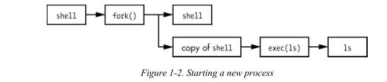

# Chapter 1 The Big Picture

## General Linux system organization
_(1.1 + extra)_
* User Processes = GUI, Servers, Shell
* Linux Kernel = System Calls, Process & Memory Management, Device Drivers
* Hardware = CPU, RAM, Disks, Network Ports

There is a critical difference between **user mode** and **kernel mode**. Code running in kernel mode has unrestricted access to the processor and main memory. **User space** refers to the parts of main memory that the user processes can access. The area that only the kernel can access is called **kernel space**.

## Hardware

Main memory is in its most raw form a big storage area for a bunch of 0s and 1s. A CPU is an operator on memory, it reads and writes data from and to the memory.

## The kernel

The kernel is in charge of managing tasks in four general system areas:
* Processes
* Memory
* Device drivers
* System calls and support 

**System calls** (or syscalls) perform specific tasks that a user process alone cannot do well or at all. Ex: Opening, reading and writing files. 

**fork()**: When a process calls fork(), the kernel creates a nearly identical copy of the process.
**exec()**: When a process calls exec(program), the kernel starts program, replacing the current process. 

> **Note:** All user processes on a Linux system start as a result of fork() and most of the time you also run exec() to start a new program instead of running a copy of an existing one.

 

## Users
_(1.5)_

A **user** is an entity that can run processes and own files. It has a username. The kernel does **not** manage the usernames; instead it identifies users by simple numeric identifiers called **userids**. Users exist primarily to support permissions and boundaries. 

> Every user-space process has a user owner, and processes are said to run as the owner. 

A user may terminate or modify the behavior of its own processes but it canot interfere with other users' processes. 

Only root is an exception to this. For this reason, root is known as the superuser (root access = administrator).

> As powerful as the root user is, it still runs in the operating system's user mode, not kernel mode!

**Groups** are sets of users. The primary purpose of groups is to allow a user to share file access to other users in a group.

## Extra (slides + notities)

TODO

Gebruik maken van root kan door in te loggen als root `su -` of via `sudo <COMMAND>`.
> Configuratie in `/etc/sudoers`