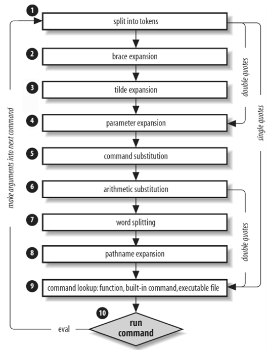

# Chapter 11 Shell Script Basics

## Shell Script Basics
_(11.1)_

The shebang (#!) starts a script followed by the type of shell the script should execute. A bash scripts starts as follows: `#!/bin/sh`.

## Quoting and Literals
_(11.2)_

Quotes are important. `echo $100` or `echo "$100"` or `echo '$100'` each mean different things and might give different output (output is: 00, 00, $100 respectively).

When writing scripts and working on the command line, remember what happens whenever the shell runs a command:

* Before running, the shell looks for variables, globs and other substitutions.
* Shell passes the results of the substitutions to the command. 

> `grep r.*t /etc/passwd` might turn into `grep r.input r.output /etc/passwd` if you have these files in your active directory. Be careful!

**Single quotes** wil resolve the example above. As far as the shell is concerned all characters between two single quotes, including spaces, make up a single parameter. 

> Note: That's why `grep 'r.*t' /etc/passwd` will work and 'r.*t /etc/passwd'` wont.

**Double quotes** work just like single quotes, except that the shell expands any variables that appear withing double quotes. 

> Note: a b c are three parameters while a "b c" are only two.

## Special Variables
_(11.3)_

_$1_, _$2_ and all variables named as positive nonzer integers contain the values of the script parameters. The built-in shell command _shift_ can be used to remove the first argument ($1) and advance the rest forward ($2 becomes $1). 

Others:

* $# is the number of arguments
* $@ reprensents all of a script's arguments
* $0 holds the name of the script
* $$ holds the process ID of the shell
* $? holds the exit code

## Exit Codes
_(11.4)_

When a Unix program finishes it leaves an _exit code_. When it is 0 it usually means that the program ran without a problem. 

> Note: If you intend to use the exit code of a command, you **must** use or store it immediately after running the command.

> Note²: When writing shell code that aborts a script, use something like exit 1 or something different from 0.

> Note³: Some programs return non-zero exit codes as a result of an operation without trying to tell you they failed. Examples are grep and diff (they return 0 if they match a pattern and 1 if they don't, 2 is then the real error code). 

## Conditionals
_(11.5)_

```bash
#!/bin/sh
if [[ "$1" = hi ]]; then
	echo 'The first argument was "hi"'
else 
	echo -n 'The first argument was not "hi" -- '
	echo It was '"'$1'"'
fi
```

> Note: [ is actually a program called _test_.

> Note²: Use "$1" when checking parameter lists to not get an error when they are empty.

**&&** and **||** are logical constructs (and and or) and can be replaced with -a and -o.

`[ -f file ]` checks whether file is a regular file (not a directory or special file). A test can be inverted with the ! operator. 


**File Tests**

Mostly unary operations (they require only one argument).
* -e true if file exists
* -s true if file is not empty

| Operator       | Tests For    |
| -------------- |:------------:|
| -f | regular file 			|
| -d | directory      			|
| -h | symbolic link    	  	|
| -b | block device      		|
| -c | character device      	|
| -p | namped pipe	      		|
| -S | socket		     		|


| Operator       | Operator   |
| -------------- |:------------:|
| -r | readable 			|
| -w | writable      			|
| -x | executable    	  	|
| -u | setuid      		|
| -g | setgid      	|
| -k | sticky bit	      		|

Finally there is the possibility for binary operators. **-nt** (newer than), **-ot** (older than) and **-ef** (compares two files and returns true if they share inode numbers and devices = hard links).


**String Tests**

| Operator       | Operator   |
| -------------- |:------------:|
| = | true if operands are equal 			|
| != | true if operands are not equal      			|
| -z | true if argument is empty    	  	|
| -n | true if argument is not empty      		|

**Arithmetic Tests**

> Note: When using numbers use -eq instead of = 

| Operator       | Returns true when first argument is .. the second   |
| -------------- |:------------:|
| -eq | equal to 			|
| -ne | not equal to      			|
| -lt | less than	  	|
| -gt | greater than     		|
| -le | less than or equal to  	|
| -ge | greater than or equal to	|

Matching strings with case example:

```bash

#!/bin/sh

case $1 in
	bye)
		echo Fine, bye.
		;;
	hi|hello)
		echo Nice to see you.
		;;
	what*)
		echo Whatever.
		;;
	*)
		echo 'Huh?'
		;;
esac

```

## Loops
_(11.6)_

### For loops (foreach)

```bash

#!/bin/sh
for str in one two three four; do
	echo $str
done

```

### While loops 

```bash

#!/bin/sh

FILE=/tmp/whiletest.$$;
echo firstline > $FILE
while tail -10 $FILE | grep -q firstline; do
..
done

```

## Command Substitution
_(11.7)_

The Bourne shell can redirect a command's standard output back to the shell's own command line. You can store the command output in a shell variable by enclosing a command in $().

> Note: Consider using a pipeline to _xargs_ (or use the -exec option) if you want to invoke a command on several filenames that you get as a result of a _find_ command.

> Note²: The traditional syntax for command substitution is are back-ticks. Use the newer $() instead.

## Temporary File Management
_(11.8)_


The `mktemp` command can be used to create temporary filenames. 

```bash

#!/bin/sh

TMPFILE1=$(mktemp /tmp/im1.XXXXXX)
TMPFILE2=$(mktemp /tmp/im2.XXXXXX)

..

rm -f $TMPFILE1 $TMPFILE2

```

> Note: If the script is aborted, the temporary files could be left behind. Use the `trap` command to create a signal handler to catch the signal that CTRL-C generates and remove the temporary files!

`trap "rm -f $TMPFILE1 $TMPFILE2; exit1" INT`


## Here Documents
_(11.9)_

Used for a large section of txt. 

```bash

#!/bin/sh

DATE=$(date)
cat <<EOF
Date: $DATE

The output above is from the Unix date command.
It's not a very interesting command.
EOF

```
The <<EOF and EOF control the here document. 


## Extra (slides + notities)

* Use ( ) for subshell.
* `read var` reads from standard input and stores in $var.


_(Slides)_



TODO detail of sequence.

`var=$(printf)` wordt beter vervangen door `printf -v var`.

**Process substitution** kan via `<(...)` of `>(..)`.

I/O gebeurt via **file descriptor**, gekoppeld aan tijdelijke **named pipe** `ls -l <(:) >(:)`. Dit kan een alternatief bieden voor pipes en subshells. 

TODO vb van process substitution.

**Parameter expansion** ondersteunt extended globbing.

TODO vb van parameter expansion.

**Arithmetic substitution**.

TODO vb van arithmetic substitution.

Speciale variabelen zijn:

* $0
* $?
* $$
* $-
* $IFS
* $REPLY
* $BASHOPTS & $SHELLOPTS
* $LINENO
* $RANDOM
* $SECONDS
* $PWD & $OLDPWD
* $UID
* ${GROUPS[@]}
* ${BASH_REMATCH[@]}
* ${PIPESTATUS[@]}

