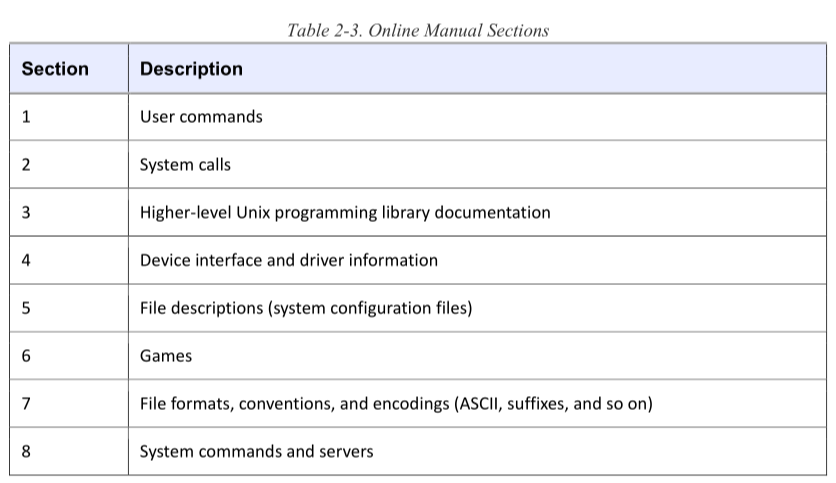
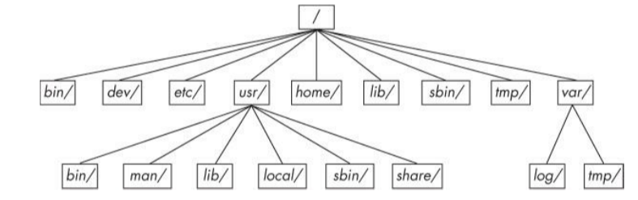
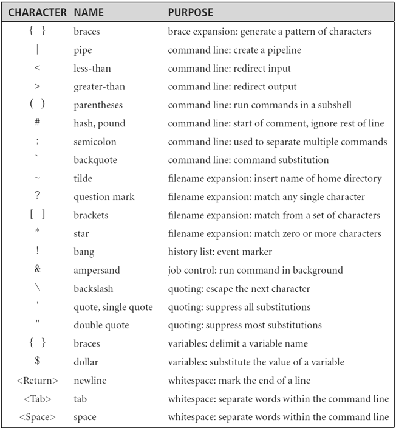

# Chapter 2 Basic Commands and Directory Hierarchy

## The Bourne Shell: /bin/sh
_(2.1 and further)_

A shell is a program that runs commands. Shell scripts are text files that contain a sequence of shell commands (cfr. windows .bat-files).

Linux uses an enhanced version of the Bourne shell called **bash** or the "Bourne-again" shell. A shell window is called a terminal.

> You can change your shell with `chsh`.

## Shell Globbing (Wildcards)
_(2.4 and further)_

* Anything with `*`
* Just one with `?`

> If you don't want the shell to expand a glob in a command, enclose the glob in single quotes.

> Note: shell performs expansions before running commands, and only then. 

`ls` wont display dotfiles, `ls -a` will show them.
> You can run into problems with globs because `.*` matches `.` and `..`. You may want to use something as .[^.]* or .??* to get all dot files except the current and parent directories.

## Environment and Shell Variables
_(2.8 and further)_

Assign with `$FOO=bar` and access with `$FOO`.
An **environment variable** is a variable not specific to the shell. If you want this use `export FOO`.

## The Command Path
_(2.9)_

PATH is a special environment variable that contains the command path (=list of system directories that the shell searches when trying to locate a command). You can change this as follows `PATH=dir:$PATH` or `PATH=$PATH:dir`. 

## Special characters
_(2.10)_

| Character 	| Uses 					| 
| ------------- |:---------------------:| 
| * 			| regexp, glob char 	|
| . 			| current directory, file/hostname delimiter      | 
| ! 			| negation, command history      |
| &#124;		| command pipes |
| / | directory delimiter, search command |
| \ | literals, macros (never directories) |
| $ | variable denotation, end of line |
| ' | literal strings |
| ` | command substitution $() |
| " | semi-literal strings |
| ^ | negation, beginning of line |
| ~ | negation, directory shortcut |
| # | comments, substitutions, preprocessor |
| [] | ranges | 
| {} | statement blocks, ranges |
| _ | cheap substitude for a space |

## Shell Input and Output
_(2.14)_

`command > file` and `command >> file` to append.

> set -C to avoid clobbering in bash.

`ls /fffffff > f 2> e` will send standard output to f and standard error to e. The number 2 specifies the stream ID that the shell modifies. 1 is output (default), 2 is error. You can also send the standard error to the same place as stdout with the `>&` notation. So to send both to f we use `ls /fffffff > f 2>&1`.

## Listing and manipulating processes

`kill pid` to kill a pid. To freeze use `kill -STOP pid` and to unfreeze or continu use `kill -CONT pid`. CTRL+C is the same thing as performing a kill with the INT(interrupt) signal.

A TSTP signal can be send by pressing CTRL+Z, then start the process again by entering `fg` or `bg`. Use `jobs` to see if you have still processes hanging.

Use `COMMAND &` to put it in background. 

## File modes and Permissions
_(2.17)_

-rw-r--r-- shows that the file (- no d) is readable, writable foor user, only readable for group and only readable for others.

To modify permissions use `chmod`. For example `chmod go+r file` or `chmod 644 file`. The numbers are combinatons of (4,2,1) where 4 is reading, 2 is writing and 1 is executing, therefore 644 is read/write for user, and read for both group and others. 711 is read/write/execute for user, execute for both group and others.

A symbolic link can be created with `ln -s target linkname` and is essentialy a shortcut to another file.

## Archiving and Compressing Files

* `gunzip file.gz` to unzip or `gzip file` to compress.
* `tar cvf archive.tar file1 file2` to create an archive.
* `tar xvf archive.tar` to unpack the tar.
* `tar ztvf file.tar.gz` to do both.

> Note: .tgz is the same as .tar.gz (the suffix was meant to fit into FAT filesystems).

## Linux Directory Hierarchy Essentials

* /bin contains ready to run programs
* /dev device files
* /etc system configuration directory
* /home personal directories for regular users
* /lib libraries for executables (shared)
* /proc provides system statistics
* /sys similar to /proc, it provides a device and system interface
* /sbin system executables (mostly system management)
* /tmp temporary folders & files (used as workspace)
* /usr contains large directory hierarchy
* /var variable subdirectory where programs record runtime information.
* /boot kernel boot loader files
* /media attachment point for removable media
* /opt for third-party software

## Used commands & shortcuts in this chapter
* echo, cat, ls, man, info, ps (auxw)
* cp, mv, touch, rm, cd
* mkdir, rmdir
* grep (-i: case-insensitive ; -v: inverts ; -E: egrep )
* less (more), pwd (-P: physical (avoid symlinks)), diff (-u: numbers), file
* find, locate (note: locate works with index)
* head, tail, sort
* CTRL-D (stops current standard input entry and return to shell)
* CTRL-C (terminates a program)
* CTRL-B -F -P -N (move cursor left, right, up, down)
* CTRL-A -E (beginning/end of line)

## Extra (slides + notities)

_(Slides)_

shell:
* **user interface** (CLI)
* **command interpreter** (interactief)
* **uitvoering scripts** (niet-interactief)

Soorten shells: Bourne (sh -> bash) op Linux, Korn (ksh) op System V, Joy (csh) op BSD en Falstad (zsh).

Om een lijst van beschikbare shells op te vragen gebruik het commando `chsh -l`. `chsh -s` kan gebruikt worden om de shell te wijzigen. Dit kan terminaal zijn voor root!

`declare -p` geeft een overzicht van alle shell variabelen. Het-x attribuut wijst op ee environment variabele. `env` geeft een overzicht van de environment.

**Shell options** zijn zogenaamde on/off switches. -:on, +:off. Voorbeeld: `set +o errexit` of `set -o noglob`. Om de ingestelde opties te bekijken gebruik `echo $SHELLOPTS` of `echo $-`.

Sommige shell opties kunnen enkel via **shopt** opgevraagd of ingesteld worden. `shopt -s ...` stelt iets in, `shopt -u ...` schakelt het uit. `echo $BASHOPTS` kan je gebruiken om ingestelde shopt opties te bekijken.

Sommige uitvoerbare programma's zijn bash _builtin_ (door bash geïmplementeerd) de rest wordt _extern_ genoemd. Builtin is doorgaans efficiënter.

`which [-a] ...`, `type [-a] [-t] ...` kan men gebruiken om te ontrafelen of programma's builtin of extern zijn.

`echo ${BASH_CMDS[...]}` voor _hashed_. `enable [-a] [-n] ... ...` kan men gebruiken om builtins te disablen of enablen.

_Weak_ quotes zijn dubbele quotes. Hierbinnen behouden de speciale tekens hun betekenis. Single quotes zijn _strong_ quotes en dus letterlijk. $'..' worden POSIX quotes genoemd en behouden eveneens hun speciale betekenis.

I/O kanalen:
* STDIN 0< of < 
* STDOUT 1> of >, 1>> of >>, 1>| of >|
* STDERR 2>, 2>>, 2>&1, >&, &>

> Note: niet te verwarren met _file descriptors_.

Help:
* man
* info
* help
* /usr/share/doc/*

Filters:
* cat
* tac
* rev
* wc
* head
* tail
* nl
* cut
* od
* hexdump
* sort
* uniq
* fold
* fmt
* strings
* tr
* grep
* perl
* xargs

File Modes and Permissions:
* `ls -l`
* `chown`, `chgrp` en `chmod`
* `umask` en `umask -S`

Manipulating Processes:
* `ps`
* `echo $$`
* `pstree`
* `kill`
* `pgrep`
* `pkill -signal`
* `sleep`
* `suspend`
* `jobs`
* `%` of `fg` en `bg`
* `wait`

TODO uitleg setuid, setgid, sticky bit

TODO vb'n van:
* declare -x, declare +x, echo ${}, declare -p, unset, export
* man -k (apropos), man -f (whatis)
* stat, comm, paste, join, split
* `echo [-e] [-n]`
* (s)locate
* find
* | xargs, -exec|ok, | bash
* filters
* kills, sleep, ..
