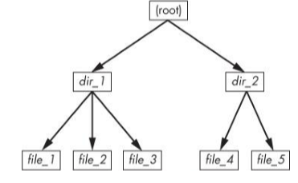

# Chapter 4 Disks and Filesystems

Partitions are subdivisions of the whole disk. The kernel presents each partition as a block device, just as it would an entire disk. Partitions are defined on a small area of the disk called a partition table. The next layer after the partition is the filesystem. 

## Partitioning Disk Devices
_(4.1)_

Traditional table is the one found inside the MBR (= Master Boot Record), a newer standard is GPT (Globally Unique Identifier Partition Table).

Some partitioning tools are:
* (g)parted (both MBR and GPT)
* fdisk (for MBR)
* gdisk (for GPT)

You can view your system's partition table with `parted -l`.
- **A primary partition** is a normal subdevision of the disk.
- The basic MBR has a limit of four primary partitions.
- If you want more designate one partition as an **extended partition**.
- Next you subdivide the extended partition into **logical patitions**.

To get the system ID for an MBR one can use `fdisk -l`.

With fdisk you design your new partition table before making the actual changes to the disk. Fdisk only makes the changes as you exit the program. With parted everything is "live" as you issue the commands. So be aware you don't get the chance to review the partion table before you change it with parted. Both modify the partitions entirely in user space. 

Eventually the kernel must read the partition table in order to present the partitons as block devices. The _fdisk_ utility does it as follows: after modifying the partition table, fdisk issues a single system call on the disk to tell the kernel that it should reread the partition table. The kernel then generates debugging output that you van view with dmesg. In comparison the _parted_ tools do not use this disk-wide system call. Instead they signal the kernel when individual partitions are altered. After processing a single partition change, the kernel does not produce debugging output.

To see partition changes you can use:
* `udevadm monitor --kernel`
* check _/proc/partitions_ for full partition information
* check _/sys/block/device/_ for altered partition system interfaces or _/dev_ for altered partition devices.

To force the kernel to reload the partition table on _/dev/sdf_ run this: `blockdev --rereadpt /dev/sdf`.

## Filesystems
_(4.2)_

The filesystem is a form of database. It supplies the structure to transform a simple block device into the sophisticated hierarchy of files and subdirectories that users can understand. 

List of filesystem types:
* ext4
* ISO 9660 (CD-ROM)
* FAT
* HFS+

**Creating a filesystem** will be done in user space (just like partitioning). A user-space process can directly access and manipulate a block device. Example to create an ext4 partition on /dev/sdf2 is `mkfs -t ext4 /dev/sdf2`.

When creating a filesystem, mkfs prints information such as the **superblock**. This is a key component at the top level of the filesystem database. 

**Mounting a filesystem** is a synonym for attaching a filesystem. In order to mount a filesystem you must know the filesystem's device, type and the _mount point_.

Use `mount` to know the current status of your system. Each line corresponds with one currently mounted filesystem.

To mount a filesystem use `mount -t type device mountpoint`. For example `mount -t ext4 /dev/sdf2 /home/extra`. Use `umount mountpoint` to detach. 

`blkid` (blockid) can be used to get a list of devices and corresponding filesystems and UUIDs (=Universally Unique Identifier) on your system. To mount with an UUID one can use `mount UUID=..-.. /home/extra`.

Generally Linux buffers writes to the disk. When you unmount a filesystem the kernel will automatically synchronize with the disk. If you want to force this use the `sync` command. 

Some options for mounting are:
* -r read-only mode
* -n ensures that mount does not try to update the system runtime mount database
* -t type of filesystem
* -o long options
* ro/rw read-only/read-write
* conv=auto DOS newline format to Unix style
* (no)exec
* (no)suid

Remounting can be done with `mount -n -o remount /`

**/etc/fstab** is the place to be for a list of filesystems and options. At boot time the system will look at this file to mount. Each line corresponds to one filesystem. It has six fields: _the device or UUID, the mount point, the filesystem type, options, backup information (used by dump command) and the filesystem integrity test order_. This last field is set to ensure that fsck will always run. For the root filesystem use 1, for any other use 2. 0 can be used to disable the bootup check (might be usefull for swap drives or CD-ROM drives). 

Although the /etc/fstab has been the tradition way to represent filesystems there are alternatives. **/etc/fstab.d** is an example. This directory contains individual filesystem configuration files. The idea is similar to other configuration directories. Another alternative is to configure **systemd units** for the filesystems. 

The command `df` can be used to view the size and utilization of your currently mounted filesystems. It shows the _the filesystem device, the total capacity of the filesystem in blocks of 1024 bytes, number of occupied blocks, number of free blocks, percentage of blocks in use and the mount point_.

`du` prints disk usage. The `du -s` command turns on summary mode. To evaluate a specific directory, change to that directory and run `du -s *.`.

To check a filesystem one can use `fsck`. Just like with `mkfs` there are different versions for each filesystem type. Example: `fsck /dev/sdb1`. To check without modifying anything run `fsck -n`. To recover with the use of a backup superblock use `fsck -b num` where `num` is an alternate block. To view a list of superblock backup numbers (without destroying your data) use `mkfs -n`.

> Note: You should never use fsck on a mounted filesystem. There is only one exception, if you mount the root partition read-only in single user mode, you may use fsck on it.

## Swap space
_(4.3)_

Not every partition on a disk contains a filesystem. Augmenting the RAM with disck space (i.e moving pieces of memory to and from a disk storage) is called swapping (because pieces of idlle programs are swapped to the disk in exchange for active pieces residing on the disk). The disk area used to store memory pages is called _swap (space)_. You can use `free` to see the current swap usage.

If you want to use an entire **disk partition** as swap space you need to:
* make sure the partition is empty,
* run `mkswap dev` where `dev` is the partition's device,
* execute `swapon dev` to register the space with the kernel,
* edit _/etc/fstab_ to make sure the system uses the swap space on boot time.

If you want to use a **file** as swap space you have to:
* `dd if=/dev/zero of=swapFile bs=1024k count=numMb`
* `mkswap swapFile`
* `swapon swapFile`

With `swapFile` the name of the file and `numMb` the desired size in megabyts. `swapoff` can be used to remove it from the kernel's active pool.

## Inside a traditional filesystem
_(4.5)_

A traditional Unix filesystem has 2 primary components. A pool of data blocks where you can store data and a database system that manages that data pool. Make note of the difference in the data pool and the inode table.

Compare the next two images!

How does this work? Well for any ext2/3/4 filesystem, you start at inode number 2, the root inode. Following that arrow to the data pool you can see two entries (the dir1 and dir2). They each corresponds to different inodes. 

Let's examine dir1/file2 in detail. The kernels does the following:
* Determines the path's components: dir1 & file2.
* Follows root inode to directory data.
* Finds the name of dir1 in directory data of inode 2 (which points to inode 12).
* Looks up inode 12 and verifies that it is a directory node.
* Follows inode 12 data link to the data pool.
* Locates the file2 in inode 12's directory data (which points to inode 14).
* Looks up inode 14 in directory data and sees that it is a file node.
* The kernel knows the properties of the file and can open it by following inode 14's data link.

Use `ls -i` to view inode numbers for any directory. 

> Note when counting the link count. Hard links will raise the number and don't forget the extra superblock (in root) as it tells you where to find the root inode.

The last piece of the puzzle is solving how the filesystem knows which blocks are in use and which are available. A _block bitmap_ is used for this. The filesystem reserves a series of bytes, witch each bit corresponding to one block in the data pool. 0 meaning that the block is free and 1 that it's in use. (De)allocating is a now a matter of flipping bits.

## Extra (slides + notities)

_(Slides)_

`parted -ls`
`tune2fs`
`df`
`blkid`
`lsblk -f`
`free`
`mkswap ...`
`swapon ...`

Alternatief 1 voor `/etc/fstab` is **udisks2** daemon.

`udisksctl monitor|status|dump` ...

Alternatief 2 voor `/etc/fstab` is **systemd** mount units.

Configuratie zit in `/etc/system/systemd/....mount`.
`Systemctl start|stop ....mount`.

Om inode details te zien gebruik `ls -i`, `stat`, `find ... -inum ...`.
