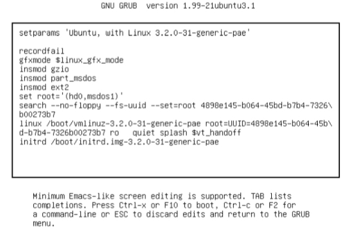

# Chapter 5 How the Linux Kernel Boots

A simplified view of the boot process looks like this:

1. The machine's BIOS or boot firmware loads and runs a boot loader.
2. The boot loader finds the kernel image on disk, loads it into memory, and starts it.
3. The kernel initializes the devices and its drivers.
4. The kernel mounts the root filesystem.
5. The kernel starts a program caled _init_ with a process ID of 1. This point is the _user space start_.
6. Init sets the rest of the system processes in motion.
7. At some point, init starts a process allowing you to log in, usually at the end ornear the end of the boot.

## Startup Messages
_(5.1)_

There are two ways to view the kernels's boot and runtime diagnostic messages:

* The kernel system log file: mostly found in `/var/log/kern.log` and/or `/var/log/messages`.
* Use `dmesg | less`.

## Kernel Initialization and Boot Options
_(5.2)_

Upon startup, the Linux kernel initializes in this order:

1. CPU inspection
2. Memory inspecton
3. Device bus discovery
4. Device discovery
5. Auxiliary kernel subsystem setup (networking, and so on)
6. Root filesystem mount
7. User space start

(ref to 6.8 _(see end of this chapter as we wont cover chapter 6)_)

## Kernel Parameters
_(5.3)_

The boot loader passes a set of text-based _kernel parameters_ that tell the kernel how it should start. You can view the kernel parameters in `/proc/cmdline`.

> Note: when looking at this file you will notice `BOOT_IMAGE=.. root=UUID=.. ro quit splash vt.handoff` for example. Don't forget that root is important as this is the location fo the root filesystem and note the `ro` is there as well. This instructs the kernel to mount in read-only mode so that fsck can check the root filesystem safely. After the check the bootup process remounts the root filesystem in read-write mode.

> Note²: Upon encountering a parameter that it does not understand, the Linux kernel saves the parameters and passes it to _init_! For example when adding `-s` to the kernel parameters the init program will start in single-user mode.

## Boot Loaders
_(5.4)_

Before the kernel and init start, a boot loader starts the kernel. It loads the kernel into memory and then starts the kernel with a set of kernel parameters. 

> Note: this is kind of a "chicken or egg" problem. Where is the kernel and what parameters should be passed on? This information is on the root filesystem but the kernel isn't running yet so how does he find it?

First of: **drivers**. Boot loaders use BIOS or UEFI(=Extensible Firmware Interface) to access disks with LBA=(Linear Block Addressing).

> Note: Boot loaders are often the only programs to use the BIOS for disk access as the kernel uses its own high-performance drivers.

Most boot loaders can read partition tables and have built-in support to read(-only) filesystems. 

### Boot Loader Tasks

* Select among multiple kernels.
* Switch between sets of kernel parameters.
* Allow the user to manually override and edit kernel image names and parameters (ex. single-user mode).
* Provide support for booting other OS's.

> Note: Basic need was always **flexibility in kernel image** and **parameter selection**. 

Examples of boot loaders are GRUB, LILO, SYSLINUX, LOADLIN, efilinux, coreboot, Linux Kernel EFISTUB.

## Grub Introduction
_(5.5)_

Grub (=Grand Unified Boot Loader) (version 2) most important capability is filesystem navigation that alows for much easier kernel image and configuration selection. 

> Note that GRUB uses it's own root. GRUB doesn't really use the Linux kernel, it **starts** it. Only the root kernel parameter will be the root filesystem. All other use of root is GRUB's own root.

### GRUB Command Line

Some basic command line tools can be used in GRUB. You can enter the command line by pressing C at the boot menu. After that you should get a GRUB prompt. `ls -l` for detailed information as it displays UUIDs. `echo $root` will return the place where GRUB expects to find the kernel. To list the files in that root you can use `ls ($root)/`. Note that this is completely different in function then previously with `ls -l`.

With `set` you can view all currently set GRUB variables ($prefix for example). Enter `boot` to boot your current configuration or just press ESC to return to the GRUB menu. 

### How GRUB works (summary)

1. PC BIOS or firmware initializes the hardware and searches its boot-order storage devices for boot code.
2. Upon finding boot code, the BIOS/firmware loads and executes it (this is where GRUB begins).
3. The GRUB core loads.
4. The core initializes. At this point, GRUB can now access disks and filesystems.
5. GRUB identifies its boot partition and loads a configuration there.
6. GRUB gives the user a chance to change configurations.
7. GRUB executes the configuration.
8. GRUB may load additional code (modules) in the boot partition.
9. GRUB executes `BOOT` command to load and execute the kernel as specified by the configurations's `linux` command.

## The initial RAM Filesystem 
**(not handled in chapter 6)**
_(6.8)_

Remember the chicken and egg problem? The Linux kernel does not talk t the PC BIOS or EFI interfaces to get data from disks. So the kernel needs loadable modules (files) but it can't access since there is no filesystem mounted in the first place. The workaround is to gather a small collection of kernel drive modules along with some other utilities into an **archive**. The boot loader loads this archive into memory before running the kernel.

Upon start, the kernel reads contents of the archive into a temporary RAM filesystem (the initramfs), mounts it at /, and performs the user-mode handoff to the init on the initramfs. Thanks to that the kernel is able to load the necessary driver modules for the real root filesystem. Finally the utilities mount the real root filesystem and start the true init.

> Note: Implementations vary, sometimes it's a shell script that starts a `udevd` to load drivers, mount and init. Another possibility is systemd installatons with no unit configuration files and just a few udevd configuration files.

## Extra (slides + notities)

TODO