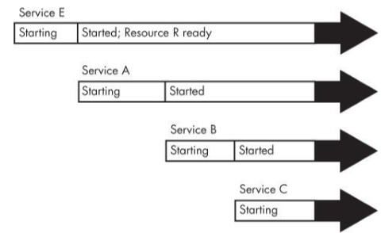
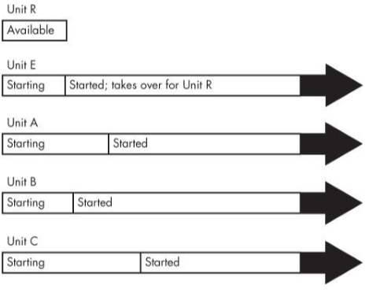

# Chapter 6 How User Space Starts

User space starts in this order:
1. Init
2. Essential low-level services such as `udevd` and `syslogd`
3. Network configuration
4. Mid- and high-level services (cron, printing...)
5. Loging prompts, GUIs, and other high-level applications.

## Introduction to init
_(6.1)_

The init program is a user-space program found in /sbin. Its main purpose is to start and stop the essential service processes on the system. Newer versions have more responsibilities though. There are three major implementations of init in Linux distributions: **System V init, systemd** and **Upstart**.

The main difference between systemd and Upstart is that systemd is goal oriented while Upstart is reactionary (reacting on events).

## System V Runlevels
_(6.2)_

The state of the machine is caled its _runlevel_ (a number from 0 through 6). You can check your system's runlevel with `who -r`. 2 through 4 is text console and 5 means GUI login. 1 is used for single-user mode, 0 for Halt/shutdown and 6 to reboot the system. These numbers may vary depending on Linux distributions.

You can find out what your init type is by looking at config files. `/usr/lib/systemd` and `/etc/systemd` show systemd. `/etc/init` with several _.conf_ files point towards Upstart and an `/etc/inittab` refers to System V.

## Systemd
_(6.4)_

 > Inspired by Apple's launchd. 

When systemd runs at boot time, the following things happens:
1. systemd loads its configuration
2. systemd determines its boot goal, which is usually named default.target
3. systemd determines all of its dependencies of the default boot goal
4. systemd activates the dependencies and the boot goal
5. after the boot, systemd can react to system events

### Units and Unit Types

Since systemd does a lot of things besides operating processes and services (such as mounting filesystems, monitoring network sockets...) there exists this term called a _unit type_. A _unit_ is a specific capability which you can turn on (activating it).

Examples are **service units, mount units, target units**. With `systemctl dot` you can see a dependency tree diagram. 

### Systemd Dependencies

Some basic types are:
* **Requires:** these are strict dependencies
* **Wants:** dependencies for activation only
* **Requisite:** units that must already be active
* **Conflicts:** negative dependencies

> Note: Attach dependencies "in reverse" such as WantedBy.

TODO summary table

You can view a unit's dependencies with the `systemctl show -p type unit` with type the type of dependency, such as Wants or Requires.

To activate units in a particular order, you can use dependency modifiers: **Before** and **After**

> If a unit foo.service contains a setting Before=bar.service and both units are being started, bar.service's start-up is delayed until foo.service is started up. 

Or in other words:

> If unit1 has the directive Before=unit2, then if both units are run, unit1 will be executed fully before unit2 starts.

### Systemd Configuration

There are two main directories for the systemd configuration. The _system unit_ directory in `/usr/lib/systemd/system` and a _system configuration_ usually found `/etc/systemd/system`.

> Note: As always don't change the /lib things as the distribution will maintain it for you. Always change the /etc.

To check the the configuration search path use `systemctl -p UnitPath show` and to see the system unit and configuration directories use `pkg-config systemd --variable=systemdsystemunitdir`and `pkg-config systemd --variable=systemdsystemconfdir`.

**Unit Files** are similar to _.ini_ files on Microsoft systems. They have section names in brackets and variable and value assignments in each section.

The **WantedBy** and **RequiredBy** dependency options are mechanisms for enabling units without modifying any configuration files. When you _enable_ a unit, systemd reads the _[Install]_ section. If there is a WantedBy dependency there systemd will perform the necessary actions (for example a symbolic link).

There are also variables and specifiers. **Variables** (such as $OPTIONS or $MAINPID) are passed in by systemd. A **specifier** is another variable-like feature often found in unit files. They start with a percent (%). 

### Some interesting (systemctl) commands

* `systemctl [list-units]` to view a list of active units.
* `systemctl --full --all` to get full names and all units (not just active).
* `systemctl status media.mount` status of a unit.
* `journalctl \_SYSTEMD\_UNIT=unit` to view a unit's entire journal.
* `systemctl reload unit` reloads configuration for unit.
* `systemctl daemon-reload`  reloads all unit configurations.
* `systemctl list-jobs` lists unit state changes.

> Note: A systemd associated with a unit can terminate but the unit itself can still be active and running afterwards. Understand the difference!

To add Units to systemd you have to create a unit file (possibly with a dependency) and afterwards you have to activate it with `systemctl start file.target`. Verifying if units run (are active) can with `systemctl status file.target file2.target`. If the unit file has an [Install] section be sure to "enable" the unit before activating it with `systemctl enable unit`.

`systemctl stop unit` or `systemctl disable unit` are for deactivating or disabling a unit respectively. After these 2 commands the unit file can then be removed.

Systemd uses _control groups_ (cgroups). The _Type_ option in your service unit file indicates startup behavior (simple|forking|notify|dbus|oneshot|idle).

> Note: Once a service has started, the systemd job that started the service terminates.

### Systemd on-demand and resource-parallelized startup

Workflow:

1. You create a systemd unit (Unit A) for the system service that you'd like to provide.
2. You identify a system resource such as a socket, file or device that Unit A uses to offer services.
3. You create another systemd unit (Unit R) to represent that resource. These units have special types such as socket units, path units and device units.
4. Upon activation of Unit R, systemd monitors the resource.
5. When anything tries to access the resource, systemd buffers the input.
6. Systemd activates Unit A.
7. When the service from Unit A is ready, it takes the control of the resource and reads the buffered input.

Some concerns are:
* Make sure that your resource unit covers every resource that the service provides.
* Make sure that the resource unit is tied to the service unit that it represents. 
* Not all servers know how to interface with the units that systemd can provide.

**Boot optimizations with Auxiliary Units**

### Systemd System V Compatibility

One feature that sets systemd apart from other newer-generation init systems is that it tries to track services started by System V init scripts. It works as follows:

1. Systemd activates runlevel<N>.target, where N is the runlevel.
2. For every symbolic link in /etc/rc<N>.d, systemd identifies the script in /etc/init.d.
3. Systemd associates the script name with a service unit (ex. /etc/init.d/foo would be foo.service).
4. Systemd activates the service unit and runs the script with either a _start_ or _stop_ argument, based on its name in rc<N>.d
5. Systemd attempts to associate any processes from the script with the service unit. 

Because of the association with a service unit you can use `systemctl` to restart the service or view its satus.

There are a lot of programs in `/lib/systemd`. Some are support or middleman such as `systemd-udevd` or `systemd-fsck`. Often they run the standard system utilities and notify systemd of the results. 

## System V init
_(6.6)_

`/etc/inittab` is the configuration file where it all starts. This file will hold a line as followed `id:5:initdefault:`. This indicates that the default runlevel is 5 (name:runlvl:actioninitshoulddo:commandtoexecute (last one is optional).

Another example is `15:5:wait:/etc/rc.d/rc 5`. This line triggers most of the system configurations and services. The _wait_ action determines when and how System V init runs the command. I.e "Run `/etc/rc.d/rc 5` once when entering runlevel 5, then wait for this command to finish. rc (run commands) 5 (runlevel) executes anything in /etc/rc5.d that starts with a number. Other examples like **initdefault** and **wait** are **respawn**, **ctraltdel** and **sysinit**.

The contents of the _rc*.d_ directories are actually symbolic links to files in another directory, _init.d_. This _link farm_ is created so that they can use the same startup scripts for all runlevels. **S** means starting and **K** refers to killing (stopping) at the start of the name of the link.

Starting and stopping a service `init.d/httpd start|stop`.

To control System V init use `telinit N` with N the runlevel number. To reload the file use `telinit q`. _s_ can be used to switch to single-user mode.

## Shutting Down Your System
_(6.7)_

Init controls how the system shuts down and reboots. `shutdown -h now` is the proper way to shut down a Linux machine. To reboot use -r instead of -h. Now is the time to shut down. You can use +n (with n the amount of minutes). Example to make the system reboot in 10 minuts `shutdown -r +10`.

> Note: The shutdown command creates a file called /etc/nologin. This prohibits logings by anyone except the superuser.

Changing the runlevel to 0 (shutdown) or 6 (reboot) goes like this:

1. Init asks every process to shut down cleanly.
2. If a process doesn't respond after a while, init kills it, first trying a TERM signal.
3. If TERM doesn't work, init uses a KILL signal. 
4. The system locks system files into place and makes other preparations for shutdown.
5. The system unmounts all filesystems other than the root.
6. The system remounts the root filesystems read-only
7. The system writes all buffered data out to the filesystem with the sync program.
8. The final step is to tell the kernel to reboot or stop. This can be done bij init or reboot, halt or poweroff.

## Emergency Booting and Single-User mode
_(6.9)_

Common tasks for fixing a system:

* Checking filesystems after a system crash.
* Resetting a forgotten root password.
* Fixing problems in critical files, such as _/etc/fstab_ and _/etc/passwd_.
* Restoring from backups after a system crash.

You can use a "live"-image to boot and restore stuff or you can go for an usable state, the single-user mode. It doesn't offer a lot though. The network won't be available in most of the cases and your terminal may not even work properly. Therefore live-images are mostly prefered.

## Extra (slides + notities)

TODO